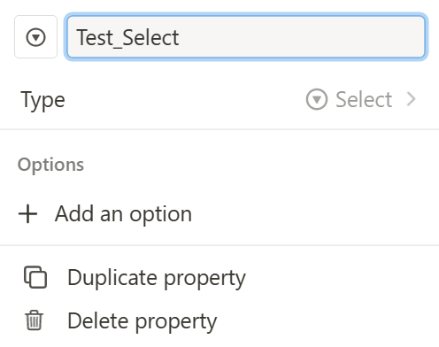
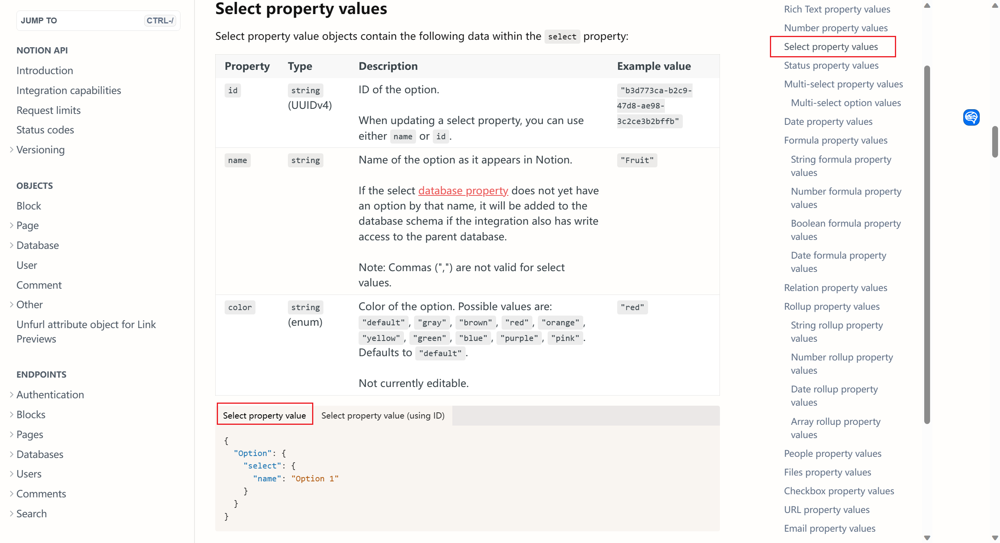

# 简要说明

1. 代码中需要改动的地方共计3处：
   - `get_need_data.py`
   - `main.py`
   - `notion_property.py`
2. `Notion`的`Database`中需要按需修改
   - 按照自己需求，比如需要增加`Text`，`Select`等自行修改即可

# Notion中的修改

不提。

# 代码中的修改

代码修改需要参照`Notion``Database`的`prosperity`，然后对应起来。

## `get_need_dada.py`

顾名思义，这一步就是对需要的数据进行筛选。可以自行学习相关`pandas`的基础知识。

### 1. 不要改动的

```python
# 必须处理的列
df["交易时间"] = df["交易时间"].map(lambda x: "".join([x[:10], "T", x[11:], "Z"])) # 转换成标准ISO8601格式
df["金额(元)"] = df["金额(元)"].map(lambda x: float(x[1:]))	# 数字必须为float之类
```

### 2.自定义

代码中已经按照通常的习惯进行了定义，你可以自定义。这里给出几种简单的方法。

- `drop`，删除某一列，直接找到该列的名称，如下：

 ```python
 df.drop(["收/支"], axis=1, inplace=True) # 删除"收/支"列
 ```

- `map`，对内容进行更改，如下：

 ```python
 df["备注"] = df["备注"].map(lambda x: x if x != "/" else "")
 ```

- 删除某一行，运用bool运算

```python
df = df[df["收/支"] != "收入"]	# 删除"收/支"列中为"收入"所在的行
# df.drop(df[df["收/支"] == "收入"].index, inplace=True)
```

## `notion_property.py`

这里就是在前一步的基础上确定需要传入`Notion`的具体参数。

具体参数需要和Notion数据一一对应，准确而言，`notion_property.py`中的参数集合被`Notion Database`中的`prosperity`集合所包含。

还是以一个例子说明吧。

1. 我先选一个`Select`，名称为`Test_Select`。请注意，这两个信息非常重要。
  

2. 根据我们的`Select`这个属性，我们去[Property values (notion.com)](https://developers.notion.com/reference/property-value-object#date-property-values)这里面去找

   

   - 重点关注说明和代码部分。

   - 我们选择使用`name`查找的

     ```python
     {
       "Option": {
         "select": {
           "name": "Option 1"
         }
       }
     }
     ```

     我们使用最简单的，至于颜色，也可自行自定义，也可以在Notion页面调整。按照这个格式进行改写。

     `Option`不是随便写的，需要和property对应。`Option 1`是需要输入进去的，我们当然也要替换。

     ```json
     {
       "Test_Select": {
         "select": {
           "name": test_select
         }
       }
     }
     ```

     这里的`test_select`是这个函数中需要传入的参数，所以不需要添加引号。

     我们把这个添加到最后，如下（因为太长，中间省略一大段代码，理解即可）：

     ```python
     def notion_property(content, price, category, date, counterparty, remarks, 
                         transaction_number="",
                         merchant_tracking_number="",
                         payment_method="undefined"):
         """将输入的内容转换为notion的json格式
         ........
         """
         properties = {
             "Name": {
                 "title": [
                 {
                     "text": {
                         "content": content
                     }
                 }  
                 ]
             },
             "Price": {
                 "number": price
             },
             "Category": {
                 "select": {
                     "name": category
                 }
             },
             "Test_Select": {
         		"select": {
           		    "name": test_select
         		}
       		}
         }
         return properties
     ```

## `main.py`

原来的代码如下：

```python
df =get_need_data(path_st)
    for i in range(len(df)):
        content = df.iloc[i]["商品"]
        price = df.iloc[i]["金额(元)"]
        category = df.iloc[i]["交易类型"]
        date = df.iloc[i]["交易时间"]
        counterparty = df.iloc[i]["交易对方"]
        remarks = df.iloc[i]["备注"]
        transaction_number = df.iloc[i]["交易单号"]
        merchant_tracking_number = df.iloc[i]["商户单号"]
        payment_method = df.iloc[i]["支付方式"]
        
        properties = notion_property(content, price, category, date, counterparty,
                                     remarks,
                                     transaction_number, 
                                     merchant_tracking_number, 
                                     payment_method
                                    )
```

想要的参数用`df.iloc[i][""]`之类表示，如` merchant_tracking_number = df.iloc[i]["商户单号"]`。`“商户单号”`就是`csv`文件中的标签。

承接上文提及的例子，加入有个标签就是`"test"`，那么我们就可以写`test_select = df.iloc[i]["test"]`，在下方函数中就可以继续添加

```
properties = notion_property(content, price, category, date, counterparty,
                                     remarks,
                                     transaction_number, 
                                     merchant_tracking_number, 
                                     payment_method,
                                     test_select
                                    )
```

大概就是这样，也许做个视频会好一些，以后有时间就考虑做个视频。

