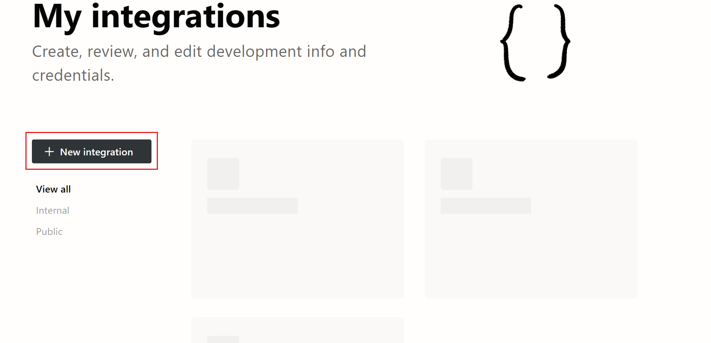
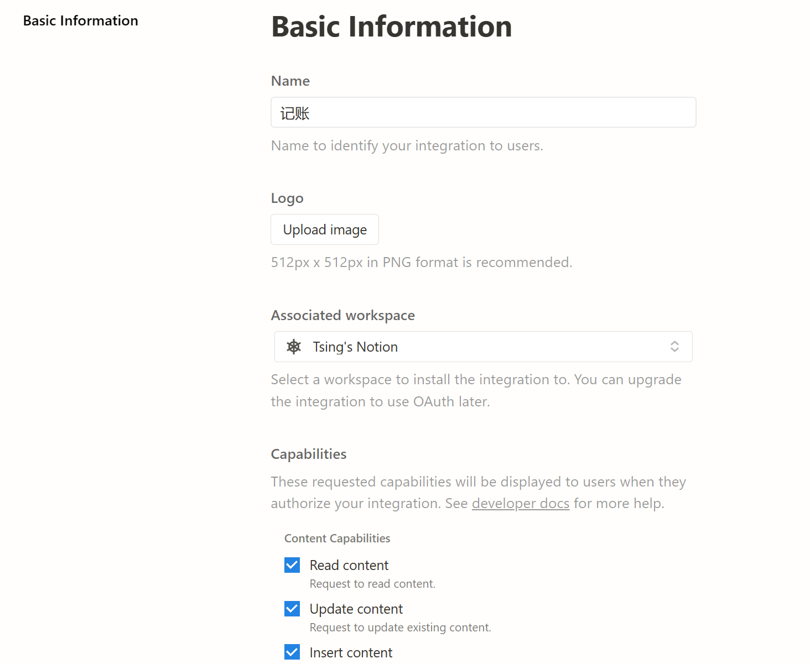
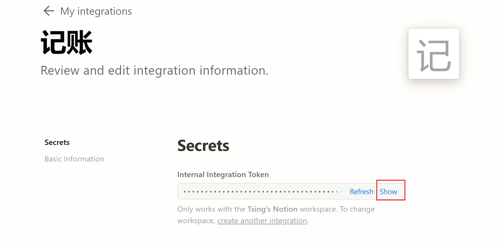
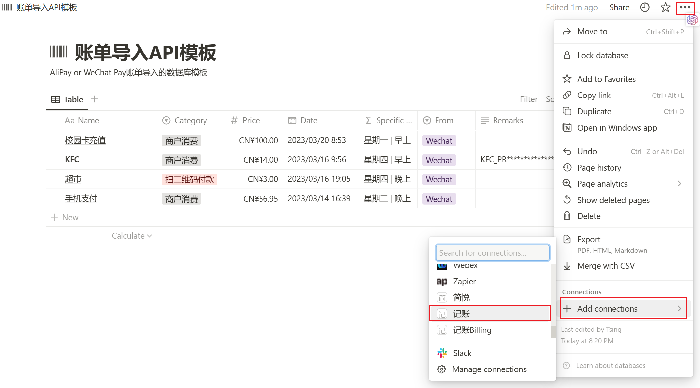

# WechatPay_to_Notion

将导出的微信付款账单再次导入至Notion，（注意，没有使用Wechat Pay的官方API）

这是个人对于Notion API一个尝试，目前仍然作为**练手项目**，目前已经相对完善，但是**完全可以使用**。<br>
我自己就在使用，导入到Notion后利用数据库视图等便于管理支出情况。

当然，寻找相关记账的模板，配合使用效果更佳哦。

# 其他说明

由于微信支付官方API仅仅对商户开放使用，普通人目前无法使用。详情点击<br>
[简介-接口规则 | 微信支付商户平台文档中心](https://pay.weixin.qq.com/wiki/doc/apiv3/wechatpay/wechatpay-1.shtml)

所以只好先将账单导出，随后利用python语言，并借助Notion提供的API接口对其进行请求，最终将内容发送至Notion数据库。

灵感来源于少数派的[这篇文章](https://sspai.com/post/66658)，但是他没有给出完整的代码。同时少数派写得比较早，但是没有随着Notion的API更新而继续更新。

# 进阶使用

[进阶指南](https://github.com/tsinglinrain/WechatPay_to_Notion/blob/main/Advanced_Instructions.md)

# 基本使用说明

## 1.Notion API申请

### 1.1访问[My integrations | Notion Developers](https://www.notion.so/my-integrations)



### 1.2点击`New integration`

简单填写`Name`，并且选择`Associated workspace`后下翻找到`Submit`并点击提交。



点击`show`后，点击`copy`，复制好后作为备用。如果是win系统，使用时敲击键盘`win`+`v`，即可查看剪贴板内容。



## 2.Notion数据库

### 2.1 创建数据库

你可以复制此[模板](https://tsinglin.notion.site/tsinglin/68951a1caaba487a884cafcd5086810c?v=3d0c405e7cae405599aed2fe0f5233cc)进行参考。<br>请注意，如果你对于官方的请求模式并不熟悉，请不要编辑本模板；如果你需要自己设置，需要参考[Introduction (notion.com)](https://developers.notion.com/reference/intro)，并对python代码进行相关修改。

### 2.2 引入integration

如下图所示，点击`...`，`Add connections`，找到前面自己设置的`integration`，这里是点击`记账`。



点击`confirm`后，应当如图所示。


### 2.3复制`database id`

在浏览器中找到自己的数据库，观察上面的网址，网址应当如下所示，<br>https://www.notion.so/tsinglin/68151a1caaca488a884cafcd5086810c?v=3d0c405e7cae406599eed2fe3f9233dc<br>
复制`tsinglin/`与`?`之间的内容，这就是`database id`。

## 3.WeChat Pay账单的导出

打开微信，点击底下`我`，点击`服务`，点击右上方`钱包`，点击右上角`账单`，点击右上角`常见问题`，点击左上角`下载账单`，点击`用于个人对账`，自己选择时间，输入支付密码和邮箱。请注意邮箱一定不能填错，否则容易造成隐私泄露。

收到邮件后也会受到微信官方发来的解压密码。

总之，最终得到一份格式为`csv`的文件。

## 4.python代码设置

### 3.1下载本项目中所有文件

可以`git`下载，也可以直接下载本项目的压缩包，然后解压。

### 3.2`database id` 和 `token`填入

请将`config.yaml`复制并改成`config_private.yaml`，然后填入如下内容：

```yaml
# 请将此config.yaml复制并重命名为config_private.yaml
database_id: "aaa121************"    # 数据库ID, 要填进去哦
token: "secret_Wa***********" # token, 记得自己填写
```

解释原因：

- 可能存在有人`fork`的情况，`git`上传一般会把文件全部上传，容易把隐私不小心上传上去。
- 在`.gitignore`里面我已经设置忽略`config_private.yaml`

### 3.3重命名

将微信账单的`csv`文件复制进入此文件夹下，并且将此`csv`文件重命名为`wechat_raw.csv`。

解释原因：

1. 代码中文件位置为相对路径，必须将微信账单文件与上述文件为同一文件夹下
2. 代码中规定文件名称为`wechat_raw.csv`，必须重命名微信账单文件

### 3.4运行程序

运行`main.py`即可。

### 3.5观察运行结果

一般是出现`成功`。

出现`失败`，需要单独检查，暂时还没有返回是哪一行出现失败，以后再修改(没想好怎么改)。
