<div align="center">
  
</div>

<p align="center"><b>WeChat and Alipay bills are sent to emails, and email attachments are extracted and imported into Notion</b></p>
<p align="center"><b>微信和支付宝账单发送至邮箱，邮件提取附件导入Notion</b></p>

<p align="center">
  
  
  
  
  
</p>

<p align="center">
  [<a href="docs/README_EN.md">English</a>] | [<a href="docs/README_zh_TW.md">中文(繁體)</a>] | [<a href="docs/README_JP.md">日本語</a>]
</p>

<div align="center">
  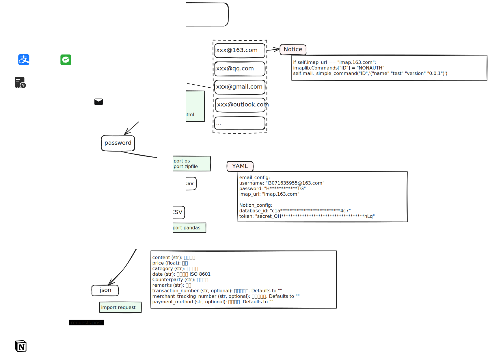
</div>

## 其他说明

> 寻找相关记账的模板，配合使用效果更佳哦。

> 没有使用WeChat Pay以及Alipay的官方API）微信支付和支付宝官方API仅仅对商户开放使用，普通人目前无法使用。<br>
详情点击:<br>
    [简介-接口规则 | 微信支付商户平台文档中心](https://pay.weixin.qq.com/wiki/doc/apiv3/wechatpay/wechatpay-1.shtml) <br>
    [查询账单接口 - 支付宝文档中心 (alipay.com)](https://opendocs.alipay.com/open-v3/b6ddabc9_alipay.ebpp.bill.get)

> 灵感来源于**少数派**的[这篇文章](https://sspai.com/post/66658)，感谢少数派提供的思路。

## 快速开始

- 开通某个邮箱的IMAP协议，请自行互联网搜寻。这里给163邮箱的开通流程作为示例，[帮助中心_常见问题IMAP (163.com)](https://help.mail.163.com/faqDetail.do?code=d7a5dc8471cd0c0e8b4b8f4f8e49998b374173cfe9171305fa1ce630d7f67ac2a5feb28b66796d3b)

- 导出账单，发送至邮箱
<div align="center">
  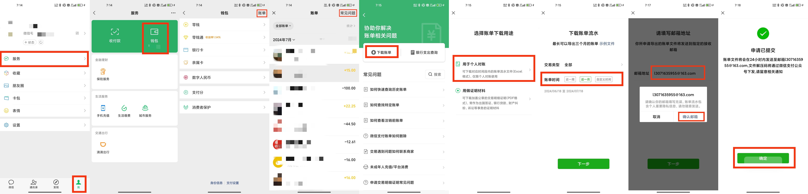
  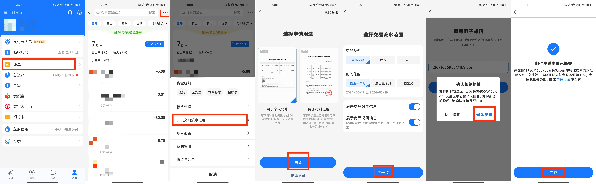
</div>

- 拷贝示例数据库，建议`duplicate`此[账单导入Notion模板](https://tsinglin.notion.site/68951a1caaba487a884cafcd5086810c?v=3d0c405e7cae405599aed2fe0f5233cc)，熟悉之后可自行修改

- 自定义Notion Integration
  <details>
    <summary>Notion Integration</summary>
    键入`https://www.notion.so/profile/integrations`

    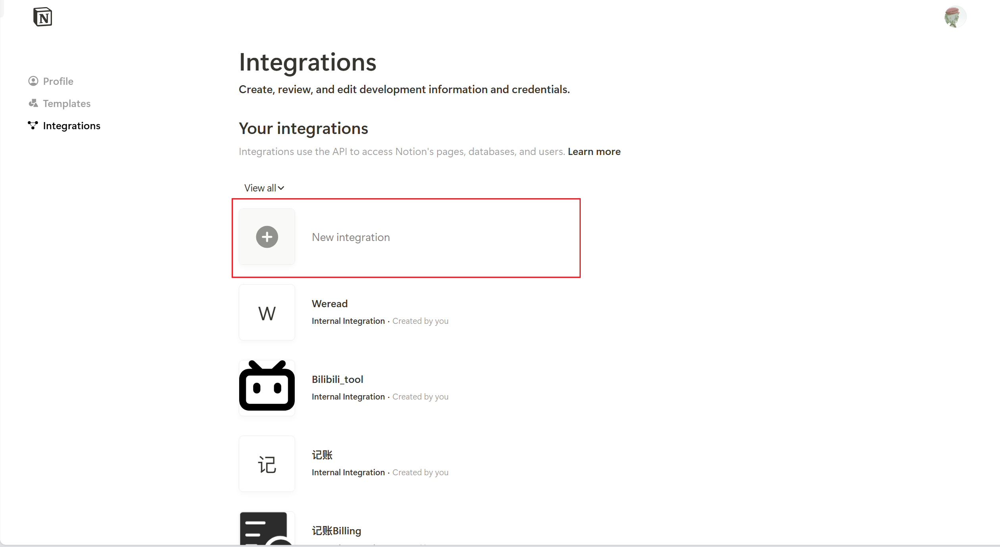
    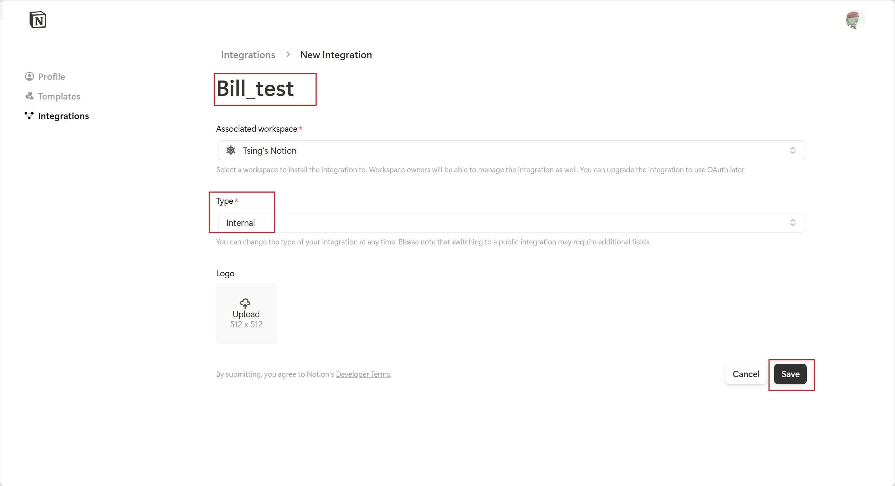
    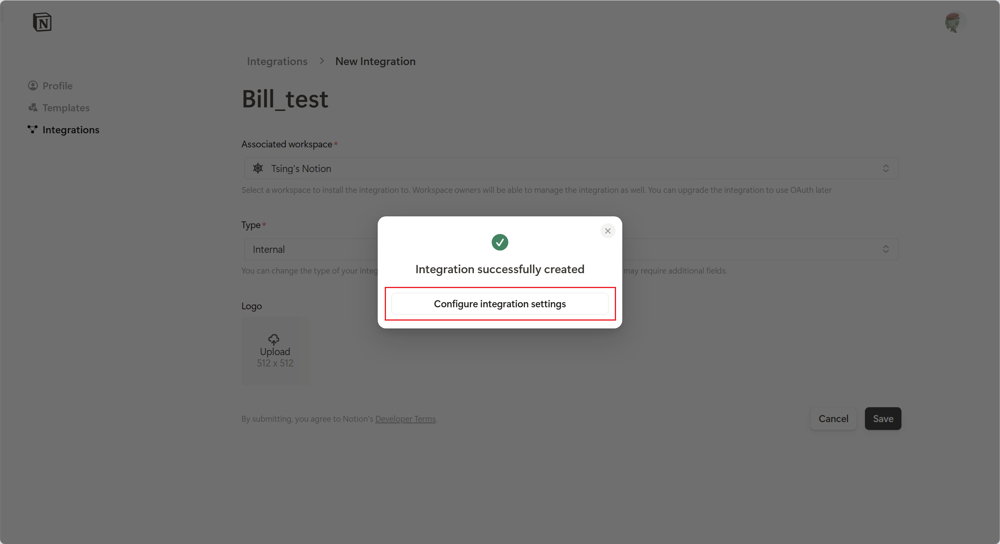
    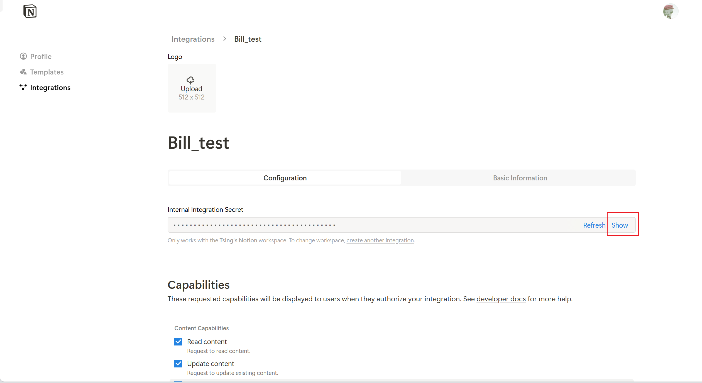
    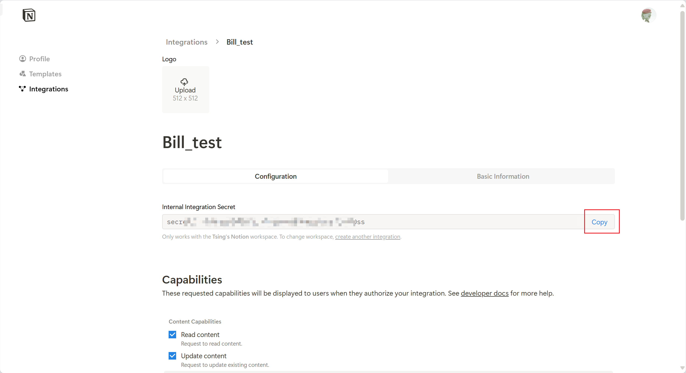
    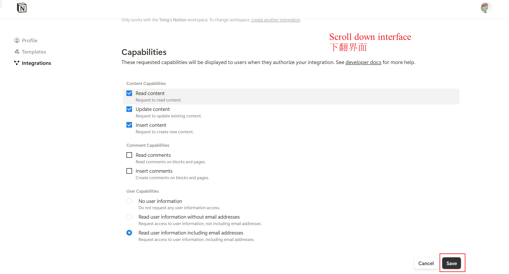
    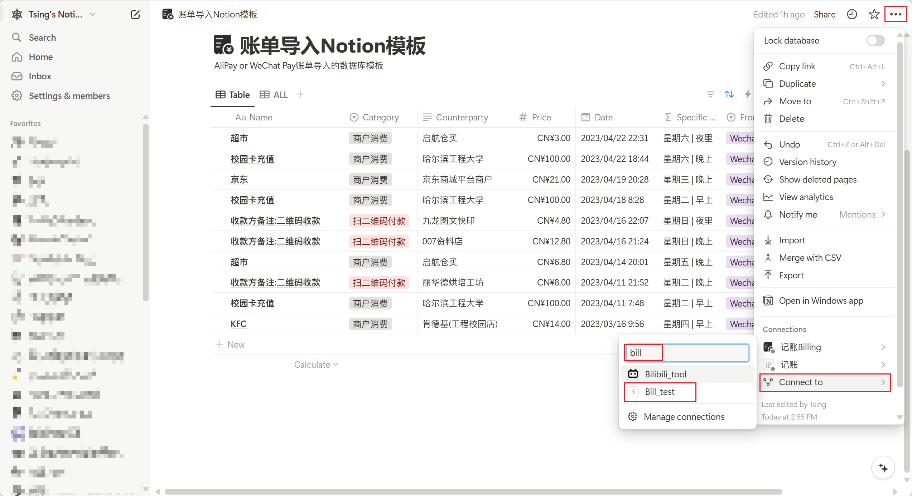
    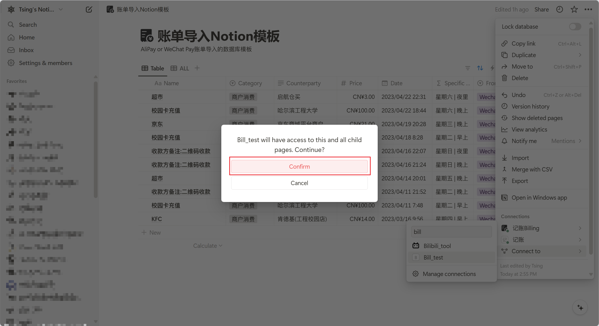
  </details>

- 下载本项目

- 安装所需库

  ```python
  pip install -r requirements.txt
  ```

- 运行`config_duplicate.py`文件

- 填写`config_private.yaml`文件，如下

  ```yaml
  email_config:
    imap_url: "l3*********@163.com"
    password: "HZ************TG"
    username: "imap.163.com"

  notion_config:
    database_id: "c1a348********************4c7"  # 数据库ID
    token: "secret_OHvKVP*******************Lq" # token
  ```

  <details>
    <summary>database_id details</summary>
    
      https://www.notion.so/tsinglin/68111a1sssssss487a884cafcd5333310c?v=3d0c405e7cae405599aed2fe0f5233cc

      database_id: 68111a1sssssss487a884cafcd5333310c

  </details>

- 账单发送到邮箱后，会有消息告知密码，请复制此密码，自己邮箱发送密码给自己，**格式必须如下**：
  <details>
  <summary>格式示例</summary>
  

  即自己发给自己且标题必须形为`alipay解压密码123456`或者`wechatpay解压密码123456`，原因是代码规定如此，改了必报错。
  ```python
  def get_passwd(self):
    # 检查邮件发件邮箱是否是自己的邮箱
    flag = False
    if self.from_addr == self.username:
        print("Subject,from get_passwd:", self.subject)
        if self.payment_platform == "alipay":
            if re.match("^alipay解压密码[0-9]{6}$", self.subject):
                print("Subject:", self.subject)
                self.paswd = self.subject[-6:]
                print("Password:", self.paswd)
                flag = True
        elif self.payment_platform == "wechatpay":
            if re.match("^wechatpay解压密码[0-9]{6}$", self.subject):
                print("Subject:", self.subject)
                self.paswd = self.subject[-6:]
                print("Password:", self.paswd)
                flag = True
    return flag
  ```
  </details>
- 运行`main.py`

## 自定义

pass

## 下一步计划

- `Linux`环境下自动化

- 导入成功后邮件返回提醒

- 可以设置每月自动导出提醒

## Star History

[](https://star-history.com/#tsinglinrain/WeChatPay_to_Notion&Date)