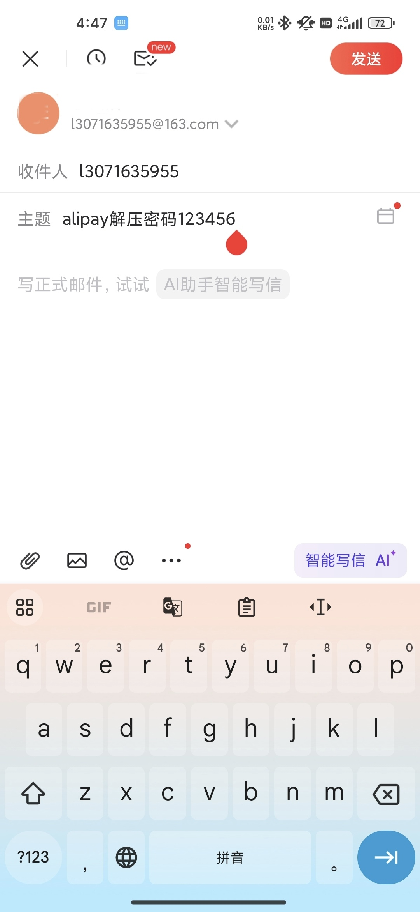

<div align="center">
  
</div>

<p align="center">
  
  
  
  <a href="https://github.com/ambv/black"></a>
  
  <a href="https://github.com/ramnes/notion-sdk-py"></a>
</p>

<p align="center">
  [<a href="docs/README_EN.md">English</a>] | [<a href="docs/README_zh_Hant.md">中文(繁體)</a>]
</p>

<div align="center">
  
</div>

<div align="center">
  
</div>

<details>
  <summary>导入效果静态图</summary>
    <div align="center">
      
</div>
</details>

<details>
  <summary>项目具体偏向代码的流程图</summary>
    <div align="center">
      
</div>
</details>

## 其他说明

> 寻找相关记账的模板，配合使用效果更佳哦。

> 没有使用WeChat Pay以及Alipay的官方API）微信支付和支付宝官方API仅仅对商户开放使用，普通人目前无法使用。<br>
详情点击:<br>
    [简介-接口规则 | 微信支付商户平台文档中心](https://pay.weixin.qq.com/wiki/doc/apiv3/wechatpay/wechatpay-1.shtml) <br>
    [查询账单接口 - 支付宝文档中心 (alipay.com)](https://opendocs.alipay.com/open-v3/b6ddabc9_alipay.ebpp.bill.get)

> 灵感来源于**少数派**的[这篇文章](https://sspai.com/post/66658)，感谢少数派提供的思路。

## 快速开始

- 开通某个邮箱的IMAP协议，请自行互联网搜寻。
- 这里给163邮箱的开通流程作为示例，[帮助中心_常见问题IMAP (163.com)](https://help.mail.163.com/faqDetail.do?code=d7a5dc8471cd0c0e8b4b8f4f8e49998b374173cfe9171305fa1ce630d7f67ac2a5feb28b66796d3b)
- 这里给出QQ邮箱示例，[QQ邮箱开通IMAP步骤](https://i.mail.qq.com/app/app_register_help/imap_163.html)

- 导出账单，发送至邮箱
<div align="center">
  
  
</div>

- 拷贝示例数据库，建议`duplicate`此[账单导入Notion模板](https://tsinglin.notion.site/68951a1caaba487a884cafcd5086810c?v=3d0c405e7cae405599aed2fe0f5233cc)，熟悉之后可自行修改

- 内部集成认证流程设置
  
  <details>
    <summary>Notion Integration</summary>

    可以参考官方文档[Internal integration auth flow set-up](https://developers.notion.com/docs/authorization)

    键入`https://www.notion.so/profile/integrations`

    
    
    
    
    
    
    
    
  </details>

- 下载本项目

  注意本项目没有release， 需要自行下载。
  
  ```python
  git clone https://github.com/tsinglinrain/WeChatPay_to_Notion.git
  ```

  或者

  下载本项目代码

- 安装所需库

  ```python
  pip install -r requirements.txt
  ```

- **新版本配置方式（推荐）**: 使用环境变量配置

  本项目现在支持环境变量配置，更适合Docker部署：

  ```bash
  # 1. 复制环境变量模板文件
  cp .env.template .env
  
  # 2. 编辑 .env 文件，填入您的配置信息
  # EMAIL_USERNAME=your_email@example.com
  # EMAIL_PASSWORD=your_email_password
  # EMAIL_IMAP_URL=imap.example.com
  # NOTION_DATABASE_ID=your_notion_database_id
  # NOTION_TOKEN=your_notion_token
  ```


  <details>
    <summary>database_id details</summary>
    
      https://www.notion.so/tsinglin/68111a1sssssss487a884cafcd5333310c?v=3d0c405e7cae405599aed2fe0f5233cc

      database_id: 68111a1sssssss487a884cafcd5333310c

  </details>

- 账单发送到邮箱后，会有消息告知密码。请复制此密码，**自己邮箱发送密码给自己**，**格式必须如下**：
  ```text
  wechatpay解压密码110110
  alipay解压密码110110
  ```
  <details>
  <summary>格式具体示例</summary>
  

  即自己发给自己且标题必须形为`alipay解压密码123456`或者`wechatpay解压密码123456`，原因是代码规定如此，改了必报错。
  ```python
  def get_passwd(self):
    # 检查邮件发件邮箱是否是自己的邮箱
    flag = False
    if self.from_addr == self.username:
        print("Subject,from get_passwd:", self.subject)
        if self.payment_platform == "alipay":
            if re.match("^alipay解压密码[0-9]{6}$", self.subject):
                print("Subject:", self.subject)
                self.paswd = self.subject[-6:]
                print("Password:", self.paswd)
                flag = True
        elif self.payment_platform == "wechatpay":
            if re.match("^wechatpay解压密码[0-9]{6}$", self.subject):
                print("Subject:", self.subject)
                self.paswd = self.subject[-6:]
                print("Password:", self.paswd)
                flag = True
    return flag
  ```
  </details>

## 运行

### 本地Python运行

- 运行`main.py`

  ```bash
  python main.py
  ```

### Docker运行(暂时没有上线)

- **使用 docker compose（推荐）**

  ```bash
  # 1. 确保已配置 .env 文件
  cp .env.template .env
  # 编辑 .env 文件填入配置信息
  
  # 2. 构建并运行
  docker compose up --build
  ```

- **直接使用 Docker**

  ```bash
  # 构建镜像
  docker build -t wechatpay-to-notion .
  
  # 运行容器
  docker run --rm \
    -e EMAIL_USERNAME="your_email@example.com" \
    -e EMAIL_PASSWORD="your_email_password" \
    -e EMAIL_IMAP_URL="imap.example.com" \
    -e NOTION_DATABASE_ID="your_notion_database_id" \
    -e NOTION_TOKEN="your_notion_token" \
    -v $(pwd)/attachment:/app/attachment \
    -v $(pwd)/bill_csv_raw:/app/bill_csv_raw \
    wechatpay-to-notion
  ```

## 自定义

pass

## 下一步计划

- `Linux`环境下自动化

- 导入成功后邮件返回提醒

- 可以设置每月自动导出提醒

## Star History

[](https://star-history.com/#tsinglinrain/WeChatPay_to_Notion&Date)