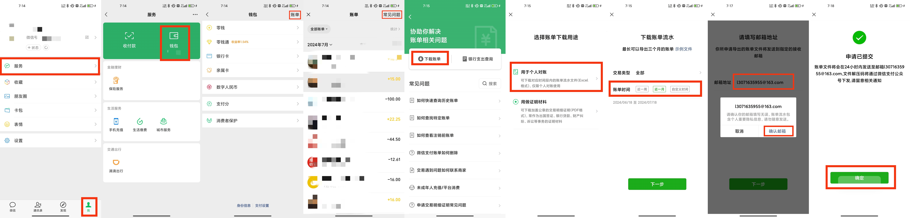
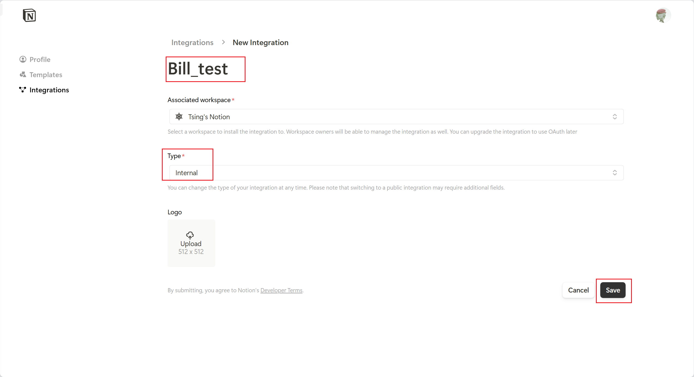
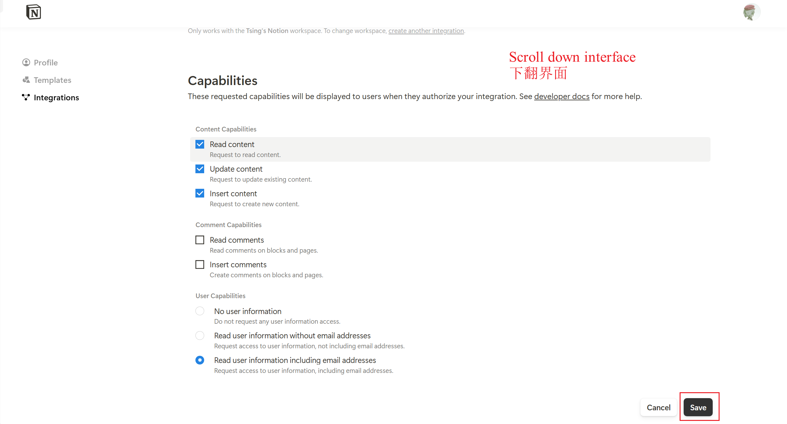

<div align="center">
  
</div>

<p align="center"><b>WeChat and Alipay bills are sent to emails, and email attachments are extracted and imported into Notion</b></p>
<p align="center"><b>微信和支付宝账单发送至邮箱，邮件提取附件导入Notion</b></p>

<p align="center">
  
  
  
  
  
</p>

<div align="center">
  
</div>

## Additional Notes

> It is recommended to find a related accounting template to achieve better results when using this tool.

> This project does not use the official APIs of WeChat Pay and Alipay. The official APIs are only available to merchants, and ordinary users currently cannot use them.
For more details, click:
[Introduction - Interface Rules | WeChat Pay Merchant Platform Documentation Center](https://pay.weixin.qq.com/wiki/doc/apiv3/wechatpay/wechatpay-1.shtml)
[Query Bill Interface - Alipay Documentation Center (alipay.com)](https://opendocs.alipay.com/open-v3/b6ddabc9_alipay.ebpp.bill.get)

> This project was inspired by [this article](https://sspai.com/post/66658) from **SSPai**. Thanks to SSPai for providing the idea.

## Quick Start

- Enable the IMAP protocol for your email account. You can search the internet for instructions. Here is an example of how to enable it for a 163.com email account: [Help Center - Common Questions about IMAP (163.com)](https://help.mail.163.com/faqDetail.do?code=d7a5dc8471cd0c0e8b4b8f4f8e49998b374173cfe9171305fa1ce630d7f67ac2a5feb28b66796d3b)

- Export the bills and send them to your email.
<div align="center">
  
  
</div>

- Copy the sample data_source. It is recommended to `duplicate` this [Bill Import to Notion Template](https://tsinglin.notion.site/68951a1caaba487a884cafcd5086810c?v=3d0c405e7cae405599aed2fe0f5233cc). After getting familiar with it, you can modify it as needed.

- Customize the Notion Integration
  <details>
    <summary>Notion Integration</summary>
    Enter `https://www.notion.so/profile/integrations`
    
    
    
    
    
    
    
    
  </details>

- Download this project

- Run the `config_duplicate.py` file

- Fill in the `config_private.yaml` file as follows:

  ```yaml
  email_config:
    imap_url: "l3*********@163.com"
    password: "HZ************TG"
    username: "imap.163.com"

  notion_config:
    data_source_id: "c1a348********************4c7"  # Database ID
    token: "secret_OHvKVP*******************Lq" # Token
  ```
  <details>
    <summary> Details about data_source_id </summary>
    
    
    https://www.notion.so/tsinglin/68111a1sssssss487a884cafcd5333310c?v=3d0c405e7cae405599aed2fe0f5233cc

    data_source_id: 68111a1sssssss487a884cafcd5333310c
  </details>